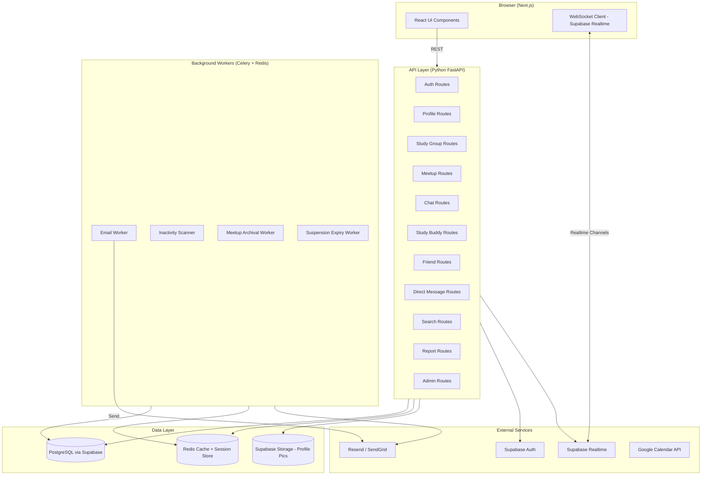
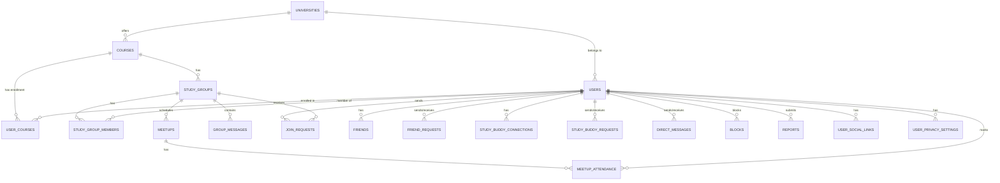
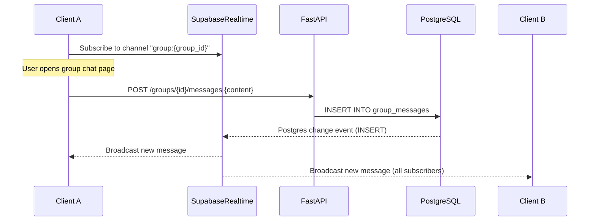
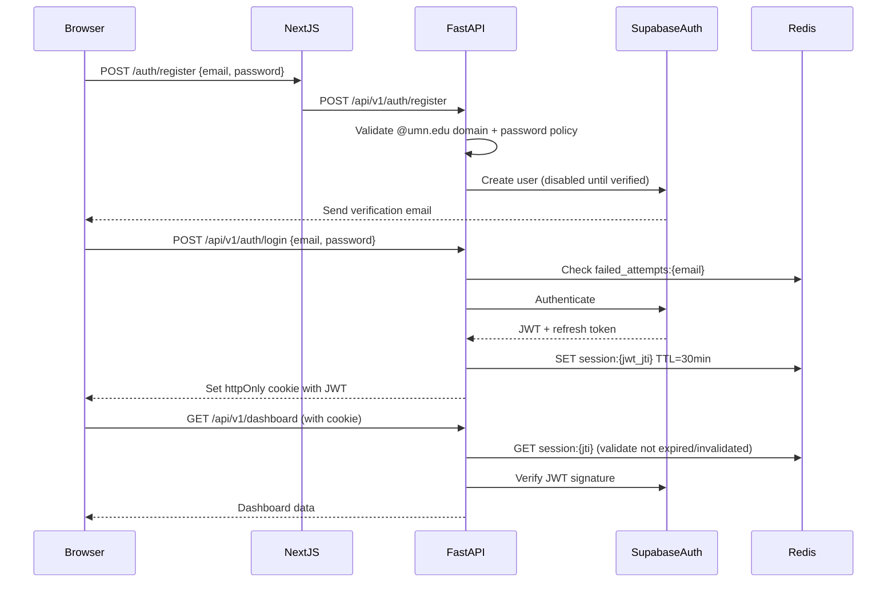

# Design Document: Goldy's Study Buddies

## Overview

Goldy's Study Buddies is a web platform enabling University of Minnesota students to form study groups, find study buddies, schedule meetups, and communicate in real time. This document describes the technical architecture, data models, API design, frontend structure, real-time messaging, background jobs, security, caching, and multi-university extensibility strategy.

The platform is designed for correctness, reliability at scale (5,000+ concurrent users), and future expansion to other universities via configuration alone.

---

## Architecture

### High-Level Component Diagram



### Architecture Decisions

**Next.js (App Router) for the frontend**: Server-side rendering for public marketing pages improves SEO and initial load time. Client components handle interactive dashboard features.

**FastAPI for the backend**: Async Python gives high throughput for I/O-bound workloads. Supabase's Python client integrates cleanly.

**Supabase for data infrastructure**: Provides PostgreSQL, Auth, Realtime, and Storage in a unified managed service, reducing operational overhead significantly for an early-stage platform.

**Redis for caching and sessions**: Course lists and suggested-user results require TTL-based cache invalidation (1–5 min per Req. 16.3). Redis also backs Celery for background jobs.

**Celery + Redis for background work**: Email delivery within 60-second SLAs, inactivity scanning, and suspension expiry all need reliable async execution outside the request cycle.


---

## Data Models

### Entity Relationship Overview




### Database Schema

#### `universities`

Enables multi-university extensibility without code changes (Req. 16.2).

| Column | Type | Constraints | Notes |
|---|---|---|---|
| `id` | `uuid` | PK, default gen_random_uuid() | |
| `name` | `varchar(200)` | NOT NULL | e.g., "University of Minnesota" |
| `email_domain` | `varchar(100)` | NOT NULL, UNIQUE | e.g., "umn.edu" |
| `course_data_source` | `varchar(100)` | | e.g., "umn_api", "manual" |
| `course_data_config` | `jsonb` | | API keys / endpoints per university |
| `is_active` | `boolean` | NOT NULL, default true | |
| `created_at` | `timestamptz` | NOT NULL, default now() | |

---

#### `users`

Extends Supabase Auth users. `id` matches `auth.users.id`.

| Column | Type | Constraints | Notes |
|---|---|---|---|
| `id` | `uuid` | PK, FK → auth.users(id) | |
| `university_id` | `uuid` | NOT NULL, FK → universities(id) | |
| `display_name` | `varchar(50)` | NOT NULL | |
| `email` | `varchar(255)` | NOT NULL, UNIQUE | @umn.edu enforced at auth layer |
| `major` | `varchar(200)` | | |
| `bio` | `varchar(500)` | | |
| `graduation_month` | `smallint` | CHECK (1–12) | |
| `graduation_year` | `smallint` | | |
| `profile_picture_url` | `text` | | Supabase Storage URL |
| `study_buddy_available` | `boolean` | NOT NULL, default false | |
| `account_status` | `varchar(20)` | NOT NULL, default 'active' | active, suspended, banned |
| `suspension_expires_at` | `timestamptz` | | NULL if not suspended |
| `last_login_at` | `timestamptz` | | |
| `inactivity_email_sent_at` | `timestamptz` | | |
| `inactivity_email_attempts` | `smallint` | NOT NULL, default 0 | |
| `created_at` | `timestamptz` | NOT NULL, default now() | |
| `updated_at` | `timestamptz` | NOT NULL, default now() | |

---

#### `user_privacy_settings`

Per-field privacy controls (Req. 3.3).

| Column | Type | Constraints | Notes |
|---|---|---|---|
| `user_id` | `uuid` | PK, FK → users(id) | |
| `hide_major` | `boolean` | NOT NULL, default false | |
| `hide_current_classes` | `boolean` | NOT NULL, default false | |
| `hide_classes_taken` | `boolean` | NOT NULL, default false | |
| `hide_future_classes` | `boolean` | NOT NULL, default false | |
| `hide_bio` | `boolean` | NOT NULL, default false | |
| `hide_graduation_date` | `boolean` | NOT NULL, default false | |
| `hide_social_links` | `boolean` | NOT NULL, default false | |
| `updated_at` | `timestamptz` | NOT NULL, default now() | |

---

#### `user_social_links`

Up to 5 social media links per user (Req. 3.1).

| Column | Type | Constraints | Notes |
|---|---|---|---|
| `id` | `uuid` | PK | |
| `user_id` | `uuid` | NOT NULL, FK → users(id) | |
| `platform` | `varchar(50)` | | e.g., "LinkedIn", "Twitter" |
| `url` | `text` | NOT NULL | Valid URL enforced at API layer |
| `sort_order` | `smallint` | NOT NULL | 1–5 |

---

#### `courses`

| Column | Type | Constraints | Notes |
|---|---|---|---|
| `id` | `uuid` | PK | |
| `university_id` | `uuid` | NOT NULL, FK → universities(id) | |
| `department_code` | `varchar(20)` | NOT NULL | e.g., "CSCI" |
| `course_number` | `varchar(20)` | NOT NULL | e.g., "1133" |
| `course_name` | `varchar(200)` | NOT NULL | e.g., "Intro to CS" |
| `is_active` | `boolean` | NOT NULL, default true | |
| UNIQUE | | `(university_id, department_code, course_number)` | |

---

#### `user_courses`

Tracks a user's course enrollment (current, taken, future).

| Column | Type | Constraints | Notes |
|---|---|---|---|
| `id` | `uuid` | PK | |
| `user_id` | `uuid` | NOT NULL, FK → users(id) | |
| `course_id` | `uuid` | NOT NULL, FK → courses(id) | |
| `enrollment_type` | `varchar(20)` | NOT NULL | current, taken, future |
| `created_at` | `timestamptz` | NOT NULL, default now() | |
| UNIQUE | | `(user_id, course_id, enrollment_type)` | |


#### `study_groups`

| Column | Type | Constraints | Notes |
|---|---|---|---|
| `id` | `uuid` | PK | |
| `course_id` | `uuid` | NOT NULL, FK → courses(id) | |
| `name` | `varchar(100)` | NOT NULL | |
| `manager_id` | `uuid` | NOT NULL, FK → users(id) | |
| `membership_mode` | `varchar(10)` | NOT NULL | open, closed |
| `max_capacity` | `smallint` | NOT NULL, CHECK (2–50) | |
| `current_member_count` | `smallint` | NOT NULL, default 1 | Denormalized for fast reads |
| `status` | `varchar(20)` | NOT NULL, default 'active' | active, inactive, archived |
| `last_activity_at` | `timestamptz` | NOT NULL, default now() | |
| `inactive_since` | `timestamptz` | | Set when status → inactive |
| `created_at` | `timestamptz` | NOT NULL, default now() | |
| `updated_at` | `timestamptz` | NOT NULL, default now() | |
| UNIQUE | | `(course_id, name)` | Per Req. 5.4 |

---

#### `study_group_members`

| Column | Type | Constraints | Notes |
|---|---|---|---|
| `id` | `uuid` | PK | |
| `group_id` | `uuid` | NOT NULL, FK → study_groups(id) | |
| `user_id` | `uuid` | NOT NULL, FK → users(id) | |
| `joined_at` | `timestamptz` | NOT NULL, default now() | Used for manager role transfer (Req. 7.6) |
| UNIQUE | | `(group_id, user_id)` | |

---

#### `join_requests`

| Column | Type | Constraints | Notes |
|---|---|---|---|
| `id` | `uuid` | PK | |
| `group_id` | `uuid` | NOT NULL, FK → study_groups(id) | |
| `user_id` | `uuid` | NOT NULL, FK → users(id) | |
| `status` | `varchar(20)` | NOT NULL, default 'pending' | pending, approved, denied, cancelled |
| `created_at` | `timestamptz` | NOT NULL, default now() | |
| `resolved_at` | `timestamptz` | | |
| UNIQUE | | `(group_id, user_id)` WHERE status = 'pending' | Prevents duplicate pending requests |

---

#### `group_invitations`

| Column | Type | Constraints | Notes |
|---|---|---|---|
| `id` | `uuid` | PK | |
| `group_id` | `uuid` | NOT NULL, FK → study_groups(id) | |
| `invited_user_id` | `uuid` | NOT NULL, FK → users(id) | |
| `invited_by_id` | `uuid` | NOT NULL, FK → users(id) | |
| `status` | `varchar(20)` | NOT NULL, default 'pending' | pending, accepted, declined |
| `created_at` | `timestamptz` | NOT NULL, default now() | |

---

#### `meetups`

| Column | Type | Constraints | Notes |
|---|---|---|---|
| `id` | `uuid` | PK | |
| `group_id` | `uuid` | NOT NULL, FK → study_groups(id) | |
| `created_by_id` | `uuid` | NOT NULL, FK → users(id) | |
| `title` | `varchar(100)` | NOT NULL | |
| `scheduled_at` | `timestamptz` | NOT NULL | Stored in UTC (Req. 9.5) |
| `format` | `varchar(10)` | NOT NULL | online, in-person |
| `location` | `text` | | Required if in-person |
| `meeting_link` | `text` | | Required if online |
| `status` | `varchar(20)` | NOT NULL, default 'upcoming' | upcoming, past, cancelled |
| `cancellation_reason` | `text` | | |
| `attending_count` | `integer` | NOT NULL, default 0 | Denormalized for fast display |
| `created_at` | `timestamptz` | NOT NULL, default now() | |

---

#### `meetup_attendance`

| Column | Type | Constraints | Notes |
|---|---|---|---|
| `id` | `uuid` | PK | |
| `meetup_id` | `uuid` | NOT NULL, FK → meetups(id) | |
| `user_id` | `uuid` | NOT NULL, FK → users(id) | |
| `status` | `varchar(15)` | NOT NULL | attending, not_attending, maybe |
| `updated_at` | `timestamptz` | NOT NULL, default now() | |
| UNIQUE | | `(meetup_id, user_id)` | |

---

#### `group_messages`

| Column | Type | Constraints | Notes |
|---|---|---|---|
| `id` | `uuid` | PK | |
| `group_id` | `uuid` | NOT NULL, FK → study_groups(id) | |
| `sender_id` | `uuid` | NOT NULL, FK → users(id) | |
| `content` | `varchar(2000)` | NOT NULL | Cap enforced at API layer (Req. 8.5) |
| `created_at` | `timestamptz` | NOT NULL, default now() | |

Index: `(group_id, created_at)` for chronological history retrieval.

---

#### `direct_messages`

| Column | Type | Constraints | Notes |
|---|---|---|---|
| `id` | `uuid` | PK | |
| `sender_id` | `uuid` | NOT NULL, FK → users(id) | |
| `recipient_id` | `uuid` | NOT NULL, FK → users(id) | |
| `content` | `varchar(2000)` | NOT NULL | |
| `is_read` | `boolean` | NOT NULL, default false | |
| `created_at` | `timestamptz` | NOT NULL, default now() | Retained 365+ days (Req. 12.3) |

Index: `(sender_id, recipient_id, created_at)` and `(recipient_id, is_read)` for unread counts.


#### `friends`

Stores the mutual friend connection as a single canonical row (smaller_id < larger_id convention).

| Column | Type | Constraints | Notes |
|---|---|---|---|
| `id` | `uuid` | PK | |
| `user_id_a` | `uuid` | NOT NULL, FK → users(id) | Always the lesser UUID |
| `user_id_b` | `uuid` | NOT NULL, FK → users(id) | Always the greater UUID |
| `created_at` | `timestamptz` | NOT NULL, default now() | |
| UNIQUE | | `(user_id_a, user_id_b)` | |
| CHECK | | `user_id_a < user_id_b` | Enforces canonical ordering |

---

#### `friend_requests`

| Column | Type | Constraints | Notes |
|---|---|---|---|
| `id` | `uuid` | PK | |
| `sender_id` | `uuid` | NOT NULL, FK → users(id) | |
| `recipient_id` | `uuid` | NOT NULL, FK → users(id) | |
| `status` | `varchar(20)` | NOT NULL, default 'pending' | pending, accepted, declined |
| `created_at` | `timestamptz` | NOT NULL, default now() | |
| UNIQUE | | `(sender_id, recipient_id)` WHERE status = 'pending' | |

---

#### `blocks`

| Column | Type | Constraints | Notes |
|---|---|---|---|
| `id` | `uuid` | PK | |
| `blocker_id` | `uuid` | NOT NULL, FK → users(id) | |
| `blocked_id` | `uuid` | NOT NULL, FK → users(id) | |
| `created_at` | `timestamptz` | NOT NULL, default now() | |
| UNIQUE | | `(blocker_id, blocked_id)` | |

---

#### `study_buddy_requests`

| Column | Type | Constraints | Notes |
|---|---|---|---|
| `id` | `uuid` | PK | |
| `sender_id` | `uuid` | NOT NULL, FK → users(id) | |
| `recipient_id` | `uuid` | NOT NULL, FK → users(id) | |
| `status` | `varchar(20)` | NOT NULL, default 'pending' | pending, accepted, declined |
| `created_at` | `timestamptz` | NOT NULL, default now() | |
| UNIQUE | | `(sender_id, recipient_id)` WHERE status = 'pending' | |

---

#### `study_buddy_connections`

| Column | Type | Constraints | Notes |
|---|---|---|---|
| `id` | `uuid` | PK | |
| `user_id_a` | `uuid` | NOT NULL, FK → users(id) | |
| `user_id_b` | `uuid` | NOT NULL, FK → users(id) | |
| `created_at` | `timestamptz` | NOT NULL, default now() | |
| UNIQUE | | `(user_id_a, user_id_b)` | Canonical smaller-first ordering |

---

#### `reports`

| Column | Type | Constraints | Notes |
|---|---|---|---|
| `id` | `uuid` | PK | |
| `reporter_id` | `uuid` | NOT NULL, FK → users(id) | |
| `reported_user_id` | `uuid` | NOT NULL, FK → users(id) | |
| `reason_category` | `varchar(100)` | NOT NULL | From predefined enum list |
| `description` | `varchar(1000)` | | |
| `status` | `varchar(20)` | NOT NULL, default 'open' | open, reviewing, resolved |
| `resolved_by_id` | `uuid` | FK → users(id) | Admin who resolved |
| `resolution` | `varchar(20)` | | none, suspended, banned |
| `created_at` | `timestamptz` | NOT NULL, default now() | |
| `resolved_at` | `timestamptz` | | |

---

#### `email_notifications`

Tracks all outbound emails for retry logic and audit (Req. 15.2).

| Column | Type | Constraints | Notes |
|---|---|---|---|
| `id` | `uuid` | PK | |
| `recipient_email` | `varchar(255)` | NOT NULL | |
| `notification_type` | `varchar(100)` | NOT NULL | e.g., "group_invitation", "join_request" |
| `payload` | `jsonb` | NOT NULL | Full template data |
| `status` | `varchar(20)` | NOT NULL, default 'pending' | pending, sent, failed, retrying |
| `attempts` | `smallint` | NOT NULL, default 0 | |
| `last_attempted_at` | `timestamptz` | | |
| `sent_at` | `timestamptz` | | |
| `created_at` | `timestamptz` | NOT NULL, default now() | |


---

## API Design

All authenticated endpoints require a valid JWT from Supabase Auth in the `Authorization: Bearer <token>` header. FastAPI middleware validates the token and injects a `current_user` dependency.

Base path: `/api/v1`

### Auth (`/auth`)

| Method | Path | Description | Req |
|---|---|---|---|
| POST | `/auth/register` | Register new account; validates @umn.edu domain | 2.1–2.5 |
| POST | `/auth/verify-email` | Verify email token from link | 2.6–2.7 |
| POST | `/auth/resend-verification` | Resend verification email | 2.7 |
| POST | `/auth/login` | Login; returns JWT; enforces lockout | 2.8–2.10 |
| POST | `/auth/logout` | Invalidate session | 2.11 |
| GET | `/auth/session` | Check session validity | 2.11 |

### Users & Profiles (`/users`)

| Method | Path | Description | Req |
|---|---|---|---|
| GET | `/users/{user_id}` | Get user profile (respects privacy settings) | 3.3 |
| PUT | `/users/me` | Update own profile fields | 3.2 |
| PUT | `/users/me/privacy` | Update per-field privacy settings | 3.3 |
| POST | `/users/me/avatar` | Upload profile picture (multipart) | 3.4–3.5 |
| GET | `/users/me/social-links` | Get own social links | 3.1 |
| PUT | `/users/me/social-links` | Update social links (full replace) | 3.1 |

### Courses (`/courses`)

| Method | Path | Description | Req |
|---|---|---|---|
| GET | `/courses` | List all courses for university (cached) | 16.3 |
| GET | `/courses/{course_id}/study-groups` | List groups for a course | 4.2 |

### Study Groups (`/groups`)

| Method | Path | Description | Req |
|---|---|---|---|
| POST | `/groups` | Create study group | 5.1–5.6 |
| GET | `/groups/{group_id}` | Get group details + members + meetups | 8.1 |
| PUT | `/groups/{group_id}` | Edit name / mode (manager only) | 7.1 |
| DELETE | `/groups/{group_id}` | Disband group (manager only) | 7.3 |
| POST | `/groups/{group_id}/join` | Join open group or request to join closed | 6.1–6.3 |
| DELETE | `/groups/{group_id}/leave` | Leave group | 7.5–7.7 |
| GET | `/groups/{group_id}/requests` | List pending join requests (manager only) | 7.1 |
| POST | `/groups/{group_id}/requests/{request_id}/approve` | Approve join request | 6.4–6.5 |
| POST | `/groups/{group_id}/requests/{request_id}/deny` | Deny join request | 6.6 |
| DELETE | `/groups/{group_id}/members/{user_id}` | Remove member (manager only) | 7.2 |

### Meetups (`/groups/{group_id}/meetups`)

| Method | Path | Description | Req |
|---|---|---|---|
| GET | `/groups/{group_id}/meetups` | List upcoming + past meetups | 9.5 |
| POST | `/groups/{group_id}/meetups` | Create meetup | 9.1–9.2, 9.7 |
| DELETE | `/groups/{group_id}/meetups/{meetup_id}` | Cancel meetup (manager only) | 9.6 |
| PUT | `/groups/{group_id}/meetups/{meetup_id}/attendance` | Set attendance status | 9.3 |
| GET | `/groups/{group_id}/meetups/{meetup_id}/calendar` | Generate Google Calendar link/auth | 9.4 |

### Group Chat (`/groups/{group_id}/messages`)

| Method | Path | Description | Req |
|---|---|---|---|
| GET | `/groups/{group_id}/messages` | Get paginated message history | 8.3 |
| POST | `/groups/{group_id}/messages` | Send message (also publishes to Realtime) | 8.2, 8.5 |

### Direct Messages (`/dm`)

| Method | Path | Description | Req |
|---|---|---|---|
| GET | `/dm` | List conversations with unread counts | 12.4 |
| GET | `/dm/{user_id}` | Get paginated message history with user | 12.3 |
| POST | `/dm/{user_id}` | Send direct message | 12.1–12.2, 12.6 |
| POST | `/dm/{user_id}/read` | Mark conversation as read | 12.4 |

### Study Buddy (`/study-buddy`)

| Method | Path | Description | Req |
|---|---|---|---|
| GET | `/study-buddy/discover` | List available study buddies (with filters) | 10.1–10.2 |
| POST | `/study-buddy/requests/{user_id}` | Send study buddy request | 10.3–10.4 |
| POST | `/study-buddy/requests/{request_id}/accept` | Accept study buddy request | 10.5–10.6 |
| POST | `/study-buddy/requests/{request_id}/decline` | Decline study buddy request | — |
| GET | `/study-buddy/connections` | List own study buddy connections | 10.1 |

### Friends (`/friends`)

| Method | Path | Description | Req |
|---|---|---|---|
| POST | `/friends/requests/{user_id}` | Send friend request | 11.1, 11.7 |
| POST | `/friends/requests/{request_id}/accept` | Accept friend request | 11.2 |
| POST | `/friends/requests/{request_id}/decline` | Decline friend request | 11.3 |
| DELETE | `/friends/{user_id}` | Remove friend (atomic) | 11.4 |
| POST | `/friends/blocks/{user_id}` | Block user | 11.5 |
| DELETE | `/friends/blocks/{user_id}` | Unblock user | 11.5 |
| GET | `/friends` | List own friends | 11.6 |

### Search & Discovery (`/search`)

| Method | Path | Description | Req |
|---|---|---|---|
| GET | `/search/users?q=<query>` | Search users by name/email | 13.1–13.2 |
| GET | `/search/suggestions` | Get up to 10 suggested users (cached) | 13.3, 16.3 |

### Reports (`/reports`)

| Method | Path | Description | Req |
|---|---|---|---|
| GET | `/reports/reasons` | List predefined reason categories | 14.1 |
| POST | `/reports` | Submit a report | 14.1–14.4 |

### Admin (`/admin`)

| Method | Path | Description | Req |
|---|---|---|---|
| GET | `/admin/reports` | List all reports | 14.5 |
| POST | `/admin/users/{user_id}/suspend` | Suspend user (body: duration_days) | 14.5–14.6 |
| POST | `/admin/users/{user_id}/ban` | Permanently ban user | 14.7 |
| POST | `/admin/users/{user_id}/unsuspend` | Manually lift suspension | — |


---

## Frontend Page and Component Structure

The frontend uses Next.js App Router. Public routes use Server Components for SEO; authenticated routes use a mix of Server Components (data fetching) and Client Components (interactive UI).

### Route Structure

```
app/
├── (public)/
│   ├── page.tsx                    # Home / Marketing page
│   ├── about/page.tsx              # About Us
│   ├── why/page.tsx                # Why Use This Platform
│   ├── testimonials/page.tsx       # Testimonials
│   ├── login/page.tsx              # Login form
│   └── register/page.tsx          # Registration form
├── (auth)/                         # Auth-protected layout
│   ├── layout.tsx                  # Checks session, redirects if not authed
│   ├── dashboard/page.tsx          # Main dashboard
│   ├── profile/
│   │   ├── [userId]/page.tsx       # View any user's profile
│   │   └── edit/page.tsx           # Edit own profile
│   ├── groups/
│   │   ├── new/page.tsx            # Create study group form
│   │   └── [groupId]/
│   │       ├── page.tsx            # Group page (chat, meetups, members)
│   │       └── settings/page.tsx   # Group settings (manager only)
│   ├── messages/
│   │   ├── page.tsx                # DM conversation list
│   │   └── [userId]/page.tsx       # DM conversation with user
│   ├── study-buddy/page.tsx        # Study buddy discovery
│   ├── friends/page.tsx            # Friends list + pending requests
│   └── admin/
│       ├── reports/page.tsx        # Admin report queue
│       └── users/[userId]/page.tsx # Admin user management
└── api/                            # Next.js API routes (proxied to FastAPI)
```

### Key Components

```
components/
├── layout/
│   ├── PublicNav.tsx               # Nav with Sign In / Sign Up buttons
│   ├── AuthNav.tsx                 # Authenticated nav with notifications
│   └── Sidebar.tsx                 # Dashboard sidebar
├── auth/
│   ├── LoginForm.tsx
│   ├── RegisterForm.tsx
│   └── PasswordStrengthMeter.tsx
├── profile/
│   ├── ProfileCard.tsx             # Summary card (name, pic, major)
│   ├── ProfileFull.tsx             # Full profile view
│   ├── ProfileEditForm.tsx         # Edit form with privacy toggles
│   └── AvatarUpload.tsx
├── groups/
│   ├── CourseGroupList.tsx         # Groups for a course
│   ├── GroupCard.tsx               # Name + member count
│   ├── CreateGroupForm.tsx
│   ├── JoinRequestButton.tsx       # Smart: shows join / requested / member state
│   ├── MemberList.tsx
│   └── GroupSettings.tsx           # Manager-only controls
├── chat/
│   ├── ChatPanel.tsx               # Group chat panel (uses Supabase Realtime)
│   ├── MessageList.tsx
│   ├── MessageInput.tsx            # 2000 char cap, validation
│   └── DMConversation.tsx
├── meetups/
│   ├── MeetupList.tsx              # Upcoming + past sections
│   ├── MeetupCard.tsx
│   ├── CreateMeetupForm.tsx
│   ├── AttendanceSelector.tsx      # Attending / Not Attending / Maybe
│   └── AddToCalendarButton.tsx
├── discovery/
│   ├── UserSearchBar.tsx           # Min 2 chars, debounced
│   ├── UserSuggestions.tsx         # Up to 10 suggestions
│   ├── StudyBuddyList.tsx
│   └── StudyBuddyCard.tsx
├── friends/
│   ├── FriendList.tsx
│   ├── FriendRequestList.tsx
│   └── BlockedUserList.tsx
└── common/
    ├── UnreadBadge.tsx             # Unread message indicator
    ├── ErrorBoundary.tsx
    ├── EmptyState.tsx              # Reusable empty state message
    └── ConfirmDialog.tsx
```

### State Management

- **Server state**: React Query (TanStack Query) for all API calls. Provides caching, refetching, and optimistic updates.
- **Realtime state**: Supabase Realtime subscription managed in dedicated hooks (`useGroupChat`, `useDirectMessages`) that sync into React Query cache.
- **Auth state**: Supabase Auth context provider at root layout.
- **UI state**: `useState` / `useReducer` for local form state; no global client store needed.


---

## Realtime and Chat Architecture

### Supabase Realtime Channels

Supabase Realtime uses WebSocket-based channels with PostgreSQL change notifications.



#### Channel Types

| Channel | Name Pattern | Purpose |
|---|---|---|
| Group Chat | `group-chat:{group_id}` | Broadcast new messages to group members |
| Direct Messages | `dm:{sorted_user_pair}` | Private DM delivery (e.g., `dm:uuid-a:uuid-b`) |
| Presence | `presence:{group_id}` | Track which members are online in a group |
| Notifications | `notifications:{user_id}` | Push friend requests, join request updates to user |

#### Message Flow

1. User sends a message via REST `POST /groups/{id}/messages`
2. FastAPI validates (auth, membership, 2000 char limit, block checks)
3. FastAPI writes to `group_messages` table in PostgreSQL
4. Supabase Realtime detects the `INSERT` via PostgreSQL logical replication and broadcasts to all subscribed clients on `group-chat:{group_id}`
5. Connected clients receive the message within the 2-second SLA (Req. 8.2)
6. Offline members have no active subscription; they receive missed messages by reading `group_messages` chronologically when they reconnect (Req. 8.6)

#### Offline Message Delivery

For group chat: On page load, the client fetches all messages from `GET /groups/{id}/messages` ordered by `created_at`. This ensures offline members get missed messages on reconnect without any special offline queue — the persistent store is the source of truth.

For direct messages: Same approach via `GET /dm/{user_id}`. The `is_read` flag drives unread counts.

#### Row-Level Security (RLS)

Supabase Realtime respects RLS policies. Channel subscriptions are authenticated using the user's JWT. RLS policies ensure:
- A user can only subscribe to `group-chat:{group_id}` if they are a member of that group
- A user can only subscribe to `dm:*` channels involving their own user ID
- Notification channels are scoped to the user's own `user_id`


---

## Background Job Design

All background jobs run via **Celery** with **Redis** as the broker. Jobs are enqueued from FastAPI endpoints and processed asynchronously.

### Job Definitions

#### Email Worker

Processes entries in `email_notifications` table with status `pending` or `retrying`.

```python
# Pseudo-code for email job
@celery.task(bind=True, max_retries=3)
def send_email_notification(self, notification_id: str):
    notification = db.get(notification_id)
    try:
        email_provider.send(
            to=notification.recipient_email,
            template=notification.notification_type,
            data=notification.payload
        )
        db.update(notification_id, status='sent', sent_at=now())
    except EmailProviderError as exc:
        if notification.attempts < 3:
            db.update(notification_id, status='retrying', attempts=attempts+1)
            raise self.retry(exc=exc, countdown=backoff(attempts))
        else:
            db.update(notification_id, status='failed')
```

All emails are inserted into `email_notifications` first, then the Celery task is enqueued. This decouples the HTTP request from email delivery and ensures the 60-second SLA (Req. 5.6, 6.2, 6.4, 6.6, etc.) is met with retry durability.

**Retry schedule for re-engagement emails** (Req. 15.2): 3 retries within 24 hours using exponential backoff capped at 8 hours.

---

#### Inactivity Scanner (Periodic Task)

Runs daily via Celery Beat.

```
InactivityScanner:
  1. Find users where last_login_at < now() - 90 days AND inactivity_email_sent_at IS NULL
     → Enqueue re-engagement email notification
  2. Find users where last_login_at < now() - 90 days AND inactivity_email_sent_at IS NOT NULL
     → Already handled; check email delivery status

  3. Find study_groups where:
     last_activity_at < now() - 60 days AND status = 'active'
     → UPDATE status = 'inactive', inactive_since = now()

  4. Find study_groups where:
     inactive_since < now() - 30 days AND status = 'inactive'
     → Archive group:
       a. Remove all study_group_members rows
       b. UPDATE study_groups SET status = 'archived'
       c. Enqueue archive notification email to all former members
```

---

#### Meetup Archival Worker (Periodic Task)

Runs every 5 minutes via Celery Beat.

```
MeetupArchivalWorker:
  1. Find meetups where:
     scheduled_at <= now() AND status = 'upcoming'
     → UPDATE meetups SET status = 'past'
```

This ensures meetups are moved from the upcoming to the past section at the correct UTC time (Req. 9.5).

---

#### Suspension Expiry Worker (Periodic Task)

Runs every 15 minutes via Celery Beat.

```
SuspensionExpiryWorker:
  1. Find users where:
     account_status = 'suspended' AND suspension_expires_at <= now()
     → UPDATE account_status = 'active', suspension_expires_at = NULL
     → Supabase Auth: re-enable auth for user
```

This auto-lifts suspensions without Admin intervention (Req. 14.8).

---

### Job Queue Configuration

| Queue | Priority | Workers | Purpose |
|---|---|---|---|
| `emails` | High | 4 | Email delivery (60-sec SLA) |
| `realtime` | High | 2 | Realtime event publication |
| `maintenance` | Low | 1 | Inactivity, archival, expiry scans |

Celery Beat schedule:
- `inactivity_scanner`: every 24 hours at 02:00 UTC
- `meetup_archival`: every 5 minutes
- `suspension_expiry`: every 15 minutes


---

## Authentication and Security Design

### Authentication Flow



### Rate Limiting and Lockout

Account lockout logic (Req. 2.10) is implemented in FastAPI with Redis:

```
Key: failed_attempts:{email}
Type: Counter with TTL
Logic:
  - On failed login: INCR failed_attempts:{email}; if new key, EXPIRE 15min
  - On 5th failure: SET locked_until:{email} = now() + 15min; return lockout error
  - On success: DEL failed_attempts:{email}
  - On login attempt: GET locked_until:{email}; if exists and not expired, reject
```

### Session Management

- Sessions stored as Redis keys: `session:{user_id}:{jti}` with 30-minute TTL
- Each API request refreshes the TTL on activity (sliding window inactivity timeout, Req. 2.11)
- On logout or suspension: Redis key deleted immediately, invalidating the session
- Supabase Auth handles JWT signing; FastAPI validates signature + checks Redis for session existence

### Password Policy Enforcement

Enforced in FastAPI before passing to Supabase Auth:
- Minimum 12 characters
- At least one uppercase letter (`[A-Z]`)
- At least one lowercase letter (`[a-z]`)
- At least one digit (`[0-9]`)
- At least one special character (`[!@#$%^&*()_+\-=\[\]{}|;':",.<>?/]`)

### Domain Validation

Email domain checked against the `universities.email_domain` table. This enables multi-university support: no hardcoded `@umn.edu` in code.

```python
def validate_email_domain(email: str, db: Session) -> University:
    domain = email.split("@")[1].lower()
    university = db.query(University).filter_by(email_domain=domain, is_active=True).first()
    if not university:
        raise HTTPException(400, "Only verified university email addresses are accepted.")
    return university
```

### Authorization (RBAC)

| Role | Capabilities |
|---|---|
| Guest | Public pages only |
| User | All authenticated features |
| Group_Manager | Manage their own group (approve, remove, edit, disband) |
| Admin | Suspend, ban, view reports |

Group_Manager authorization is checked per-request: `study_groups.manager_id == current_user.id`.

Admin authorization uses a boolean flag or a separate `user_roles` table checked in middleware.

### Security Headers

FastAPI middleware applies:
- `Content-Security-Policy`
- `X-Frame-Options: DENY`
- `X-Content-Type-Options: nosniff`
- `Strict-Transport-Security` (HTTPS only in production)

### File Upload Security

Profile picture uploads (Req. 3.4–3.5):
- MIME type validated server-side (not just extension)
- Max 5 MB enforced before streaming to Supabase Storage
- Stored in a dedicated Supabase Storage bucket with public read access only for the generated URL
- Virus scanning: optionally integrate ClamAV or Supabase's built-in scan

### Block Enforcement

Block checks run in FastAPI middleware/dependency for messaging and profile endpoints:

```python
def check_not_blocked(viewer_id: UUID, target_id: UUID, db: Session):
    block = db.query(Block).filter(
        (Block.blocker_id == target_id) & (Block.blocked_id == viewer_id)
    ).first()
    if block:
        raise HTTPException(403, "You cannot interact with this user.")
```


---

## Caching Strategy

Redis is the single caching layer, implementing TTL-based cache invalidation per Req. 16.3.

### Cached Resources

| Cache Key Pattern | TTL | Invalidation Trigger | Data |
|---|---|---|---|
| `courses:{university_id}` | 5 minutes | Admin adds/removes a course | Full list of courses for a university |
| `suggestions:{user_id}` | 1 minute | User joins a group or updates courses | Up to 10 suggested users for dashboard |
| `group_member_count:{group_id}` | 30 seconds | Member joins/leaves/is removed | Current member count |
| `search_results:{query_hash}` | 30 seconds | Not actively invalidated; short TTL | Search result page |

### Cache-Aside Pattern

All cached reads use the standard cache-aside pattern:

```python
async def get_courses(university_id: UUID, redis: Redis, db: Session):
    cache_key = f"courses:{university_id}"
    cached = await redis.get(cache_key)
    if cached:
        return json.loads(cached)
    courses = db.query(Course).filter_by(university_id=university_id, is_active=True).all()
    await redis.set(cache_key, json.dumps([c.to_dict() for c in courses]), ex=300)
    return courses
```

### Why These TTLs

- **5 minutes for courses**: Course catalogs change rarely (semester boundaries). A 5-minute stale window is acceptable and significantly reduces database load during peak traffic.
- **1 minute for suggestions**: More dynamic (users enroll in courses frequently). 1 minute balances freshness with cache efficiency.
- **30 seconds for member counts**: These are displayed on dashboard cards and group pages. Short enough to feel live, long enough to reduce write-through overhead.

### Session Store (Redis)

- Key: `session:{user_id}:{jti}` → TTL: 30 minutes, sliding window
- Key: `failed_attempts:{email}` → TTL: 15 minutes
- Key: `locked_until:{email}` → TTL: set to lockout expiry time


---

## Multi-University Extensibility

Per Req. 16.2, adding a new university requires only configuration changes — no code changes.

### Configuration Model

Each university is a row in the `universities` table:

```json
{
  "name": "University of Wisconsin–Madison",
  "email_domain": "wisc.edu",
  "course_data_source": "umn_api",
  "course_data_config": {
    "base_url": "https://api.wisc.edu/courses/v1",
    "api_key": "WISC_COURSE_API_KEY",
    "department_field": "subject",
    "course_number_field": "catalogNumber"
  },
  "is_active": true
}
```

### Course Data Source Adapter

A pluggable adapter pattern handles different university course APIs:

```python
class CourseDataAdapter(Protocol):
    def fetch_courses(self, config: dict) -> list[CourseDTO]: ...

class UMNApiAdapter:
    def fetch_courses(self, config: dict) -> list[CourseDTO]:
        # UMN-specific course API call

class ManualAdapter:
    def fetch_courses(self, config: dict) -> list[CourseDTO]:
        # Return courses from the courses table (manually entered by admin)

ADAPTERS: dict[str, CourseDataAdapter] = {
    "umn_api": UMNApiAdapter(),
    "manual": ManualAdapter(),
}
```

When a university is added, an admin selects the `course_data_source` from the supported adapter list and provides the relevant config JSON. No code deployment required.

### Email Domain Validation

Domain validation is a database lookup against `universities.email_domain`. Adding `wisc.edu` to the database immediately enables Wisconsin student registration.

### Scoping

All database queries are scoped by `university_id`. Study groups, courses, and user suggestions are isolated per university. A future "cross-university" collaboration feature could join across universities explicitly.

### Deployment

Multi-tenancy is logical (single database, multiple university rows) for the initial launch. Physical separation (per-university Supabase projects) can be added later without changing the application model.


---

## Components and Interfaces

This section defines the major software components of the platform, their responsibilities, and the interfaces through which they interact.

### Frontend Components (Next.js)

| Component | Responsibility | Key Interfaces |
|---|---|---|
| `PublicNav` | Navigation header for unauthenticated pages; renders Sign In and Sign Up buttons | Props: `activePage` |
| `AuthNav` | Navigation header for authenticated pages; shows unread message badge and user avatar | Subscribes to `notifications:{user_id}` Realtime channel |
| `LoginForm` | Handles email/password login, displays lockout error, submits to `POST /api/v1/auth/login` | Calls `Auth_Service` via REST |
| `RegisterForm` | Handles new account registration with inline password strength validation | Calls `POST /api/v1/auth/register` |
| `PasswordStrengthMeter` | Renders per-criterion password validation feedback in real time | Props: `password: string` → reads `validate_password` result |
| `Dashboard` | Primary authenticated landing page; composes `CourseGroupList`, `UserSearchBar`, `UserSuggestions`, enrolled group cards | Fetches `/courses`, `/search/suggestions`, user groups via React Query |
| `CourseGroupList` | Lists study groups for a selected course; shows join/create options per group status | Props: `courseId`, fetches `/courses/{courseId}/study-groups` |
| `GroupCard` | Displays group name, member count, and open/closed badge | Props: `group: StudyGroup` |
| `CreateGroupForm` | Multi-field form for group name, capacity, mode, and initial invitees; validates all fields client-side before submit | Calls `POST /api/v1/groups` |
| `JoinRequestButton` | Smart button that renders "Join", "Request to Join", "Requested", or "Member" based on current membership state | Props: `groupId`, `membershipState` |
| `GroupPage` | Study group detail page; composes `MemberList`, `MeetupList`, `ChatPanel`, `GroupSettings` | Fetches `/groups/{groupId}` |
| `ChatPanel` | Group chat UI; subscribes to `group-chat:{groupId}` Supabase Realtime channel; sends via REST | Uses `useGroupChat` hook |
| `MessageList` | Renders paginated message history in chronological order | Props: `messages: Message[]` |
| `MessageInput` | Text input with 2,000-char counter and submit; blocks submission over limit | Emits `onSend(content: string)` |
| `MeetupList` | Renders upcoming and past meetup sections; moves past meetups after `scheduled_at` passes | Fetches `/groups/{groupId}/meetups` |
| `CreateMeetupForm` | Form for title, date/time (local timezone), format, location/link; per-field validation | Calls `POST /groups/{groupId}/meetups` |
| `AttendanceSelector` | Renders Attending / Not Attending / Maybe selector; updates count optimistically | Calls `PUT /groups/{groupId}/meetups/{meetupId}/attendance` |
| `AddToCalendarButton` | Generates Google Calendar link for a meetup with a single click | Calls `GET /groups/{groupId}/meetups/{meetupId}/calendar` |
| `ProfileFull` | Renders a user's full profile; respects privacy settings by only displaying fields returned by API | Fetches `/users/{userId}` |
| `ProfileEditForm` | Edit form for all profile fields with per-field privacy toggles | Calls `PUT /users/me` and `PUT /users/me/privacy` |
| `AvatarUpload` | File picker with MIME and size validation before upload | Calls `POST /users/me/avatar` (multipart) |
| `UserSearchBar` | Debounced search input (min 2 chars, max 100); renders `UserSuggestions` inline on submit | Calls `GET /search/users?q=` |
| `StudyBuddyList` | Lists available study buddies with course/subject filter | Fetches `/study-buddy/discover` |
| `DMConversation` | Private message thread; subscribes to `dm:{sortedPair}` Realtime channel | Uses `useDirectMessages` hook |
| `UnreadBadge` | Displays unread message count; driven by Realtime notification channel | Props: `count: number` |
| `ReportModal` | Report submission form with predefined reason categories, optional description, and disclaimer | Calls `POST /api/v1/reports` |

---

### Backend Services (FastAPI)

| Service / Module | Responsibility | Key External Calls |
|---|---|---|
| `auth_router` | Registration, email verification, login with lockout, logout, session check | Supabase Auth SDK, Redis (lockout keys) |
| `profile_router` | CRUD for user profiles, privacy settings, avatar upload | Supabase Storage (avatar), PostgreSQL |
| `group_router` | Study group CRUD, join/leave, join request lifecycle, member removal, disband | PostgreSQL, `email_service.enqueue()` |
| `meetup_router` | Meetup creation/cancellation, attendance updates, Google Calendar link generation | PostgreSQL, Google Calendar API, `email_service.enqueue()` |
| `chat_router` | Group message persistence and history retrieval | PostgreSQL, Supabase Realtime (publish) |
| `dm_router` | Direct message persistence, history retrieval, read receipts | PostgreSQL, Supabase Realtime (publish) |
| `study_buddy_router` | Buddy discovery, request send/accept/decline, connection listing | PostgreSQL, `email_service.enqueue()` |
| `friend_router` | Friend request lifecycle, unfriend, block/unblock | PostgreSQL (atomic transactions), `email_service.enqueue()` |
| `search_router` | User search by username/email substring, suggestion generation | PostgreSQL, Redis (suggestion cache) |
| `report_router` | Report submission with disclaimer enforcement | PostgreSQL, `email_service.enqueue()` |
| `admin_router` | Report queue, suspend/ban/unsuspend actions, session termination | PostgreSQL, Supabase Auth SDK, Redis (session deletion) |
| `email_service` | Writes to `email_notifications` table and enqueues Celery `send_email_notification` task | PostgreSQL, Celery |
| `cache_service` | Cache-aside helpers for courses and suggestions; session and lockout key management | Redis |
| `block_middleware` | FastAPI dependency injected on messaging and profile endpoints; checks `blocks` table | PostgreSQL |
| `auth_middleware` | Validates Supabase JWT, checks Redis session key, injects `current_user` | Supabase Auth SDK, Redis |

---

### Background Workers (Celery)

| Worker Task | Trigger | Inputs | Outputs / Side Effects |
|---|---|---|---|
| `send_email_notification` | Enqueued by `email_service` on any notification event | `notification_id: UUID` | Calls Resend/SendGrid; updates `email_notifications.status` |
| `inactivity_scanner` | Celery Beat, daily at 02:00 UTC | None (scans full DB) | Marks users for re-engagement email; marks/archives groups; enqueues archival notification emails |
| `meetup_archival_worker` | Celery Beat, every 5 minutes | None | `UPDATE meetups SET status='past' WHERE scheduled_at <= now() AND status='upcoming'` |
| `suspension_expiry_worker` | Celery Beat, every 15 minutes | None | `UPDATE users SET account_status='active' WHERE suspension_expires_at <= now()`; re-enables Supabase Auth |

---

### External Service Interfaces

| Service | Interface Type | Used By | Purpose |
|---|---|---|---|
| **Supabase Auth** | REST + SDK | `auth_router`, `admin_router`, `auth_middleware` | User creation, JWT signing/verification, email verification flow, session management |
| **Supabase Realtime** | WebSocket (client) + SDK (server publish) | `ChatPanel`, `DMConversation`, `chat_router`, `dm_router` | Push chat messages and notifications to connected clients |
| **Supabase Storage** | REST + SDK | `profile_router`, `AvatarUpload` | Profile picture upload and CDN-served retrieval |
| **PostgreSQL (Supabase)** | SQL via SQLAlchemy (async) | All backend routers and workers | Primary data store for all application entities |
| **Redis** | TCP via `redis-py` / `celery[redis]` | `auth_middleware`, `cache_service`, Celery | Session store, rate-limit keys, cache, Celery broker |
| **Resend / SendGrid** | REST API | `send_email_notification` Celery task | Transactional email delivery (invitations, notifications, reports) |
| **Google Calendar API** | OAuth 2.0 + REST | `meetup_router`, `AddToCalendarButton` | Generate calendar event links; add meetups to user calendars |

---

## Correctness Properties

*A property is a characteristic or behavior that should hold true across all valid executions of a system — essentially, a formal statement about what the system should do. Properties serve as the bridge between human-readable specifications and machine-verifiable correctness guarantees.*

### Reflection on Consolidations

Before listing the final properties, I reviewed all testable acceptance criteria and eliminated redundancies:

- The "full group join rejected" property (6.7) and "capacity race condition on approval" (6.5) both test the `member_count <= max_capacity` invariant. They are combined into one comprehensive capacity invariant property.
- Message length cap for group chat (8.5) and direct messages (12.6) both test the same 2000-char validation function. Combined into one property.
- Block behavior (11.5) subsumes the messaging block check (12.5). The block property covers both.
- Duplicate request rejection for friend requests (11.7), study buddy requests (10.4), and join requests (6.3) all test the same idempotency pattern. Combined into one duplicate-request property.
- Privacy field hiding (3.3) and block preventing profile view (11.5) are distinct enough to remain separate.

---

### Property 1: Email Domain Validation

*For any* email address submitted during registration, the system SHALL accept it if and only if the domain portion matches an active entry in the university allowlist; no email with a non-allowlisted domain shall produce a successful registration.

**Validates: Requirements 2.1, 2.2**

---

### Property 2: Password Complexity Validation

*For any* password string, the validation function SHALL accept it if and only if it satisfies all five criteria simultaneously (length ≥ 12, contains uppercase, lowercase, digit, and special character); the error response for any invalid password SHALL list exactly the unmet criteria — no more, no fewer.

**Validates: Requirements 2.3, 2.4**

---

### Property 3: Verification Token Expiry

*For any* successful registration, the generated email verification token SHALL have an expiry timestamp equal to the token creation time plus exactly 24 hours, regardless of when the registration occurs.

**Validates: Requirements 2.5**

---

### Property 4: Login Error Indistinguishability

*For any* failed login attempt — whether the email does not exist, the password is wrong, or both — the error message returned by the system SHALL be identical in content and HTTP status code, revealing no information about which field caused the failure.

**Validates: Requirements 2.9**

---

### Property 5: Profile Privacy Enforcement

*For any* user A who has marked one or more profile fields as hidden, and *for any* authenticated user B who is not user A, the profile response for A SHALL omit all hidden fields; the set of visible fields in the response SHALL be exactly the complement of A's hidden fields.

**Validates: Requirements 3.3**

---

### Property 6: Profile Picture Upload Validation

*For any* file uploaded as a profile picture, the system SHALL accept it if and only if the file's MIME type is `image/jpeg` or `image/png` AND the file size is ≤ 5 MB; any file failing either condition SHALL be rejected with a descriptive error.

**Validates: Requirements 3.4, 3.5**

---

### Property 7: Study Group Capacity Invariant

*For any* study group and *for any* combination of join operations, approvals, and concurrent requests, the member count SHALL never exceed the group's configured `max_capacity`; any action that would push the count above capacity SHALL be rejected atomically.

**Validates: Requirements 6.1, 6.5, 6.7**

---

### Property 8: Group Membership After Join

*For any* open study group with available capacity, *for any* user who is not currently a member, after a successful join operation the user SHALL appear in the group's member list and the member count SHALL be exactly one greater than before the join.

**Validates: Requirements 6.1**

---

### Property 9: Duplicate Request Idempotency

*For any* pair of users (sender, recipient) and *for any* request type (join request, friend request, study buddy request), if a pending request already exists from sender to recipient, any subsequent identical request SHALL be rejected and the number of pending requests between them SHALL remain exactly one.

**Validates: Requirements 6.3, 10.4, 11.7**

---

### Property 10: Manager-Only Action Authorization

*For any* study group and *for any* user who is not the group's designated manager, every attempt to perform a manager-exclusive action (approve/deny requests, remove members, edit group settings, disband) SHALL be rejected with an authorization error; the group's state SHALL remain unchanged after the rejected attempt.

**Validates: Requirements 7.1**

---

### Property 11: Disband State Completeness

*For any* study group that is disbanded (by manager action or by the manager leaving as the sole member), the resulting state SHALL have zero members, zero pending join requests, and all future meetups marked as cancelled; this invariant must hold regardless of how many members, requests, or meetups existed before disbanding.

**Validates: Requirements 7.3, 7.7**

---

### Property 12: Closed-to-Open Mode Switch Auto-Approval

*For any* closed study group with P pending requests and remaining capacity C = max_capacity − current_member_count, when the mode is switched to open, exactly min(P, C) pending requests SHALL be automatically approved and the final member count SHALL equal initial_count + min(P, C), never exceeding max_capacity.

**Validates: Requirements 7.4**

---

### Property 13: Manager Role Transfer Ordering

*For any* study group where the manager leaves with at least one other member, the new manager SHALL be the member with the earliest `joined_at` timestamp; if two or more members share an identical `joined_at` timestamp, the one with the earliest `users.created_at` SHALL receive the role; no other member SHALL be assigned the manager role under any ordering of members.

**Validates: Requirements 7.6**

---

### Property 14: Message Character Limit

*For any* chat message (group or direct), a message whose character count is ≤ 2,000 SHALL be accepted; a message whose character count exceeds 2,000 SHALL be rejected before persistence with a character-limit error; no message exceeding 2,000 characters SHALL ever appear in message history.

**Validates: Requirements 8.5, 12.6**

---

### Property 15: Chat History Chronological Order

*For any* sequence of messages sent to a group chat or direct message conversation, fetching the message history SHALL return those messages in strictly ascending order of their `created_at` timestamp; no message sent before another SHALL appear after it in the returned list.

**Validates: Requirements 8.3, 12.3**

---

### Property 16: Meetup Validation Completeness

*For any* meetup creation form submission, the system SHALL report a distinct per-field error for each and every invalid field (missing title, past date/time, missing format, missing location/link for the selected format); no invalid submission SHALL succeed, and no valid submission SHALL be rejected.

**Validates: Requirements 9.1, 9.7**

---

### Property 17: Attendance Count Consistency

*For any* meetup and *for any* set of attendance updates from its members, the displayed `attending_count` SHALL equal exactly the number of members whose most recent attendance status is `attending`; updates to `not_attending` or `maybe` SHALL decrease the count; updates to `attending` SHALL increase it.

**Validates: Requirements 9.3**

---

### Property 18: Meetup UTC Archival

*For any* meetup whose `scheduled_at` (in UTC) is less than or equal to the current UTC time, after the meetup archival worker executes, the meetup's status SHALL be `past`; no meetup with a future `scheduled_at` SHALL ever be moved to past status.

**Validates: Requirements 9.5**

---

### Property 19: Study Buddy Connection Symmetry

*For any* accepted study buddy request from user A to user B, a `study_buddy_connection` record SHALL exist that includes both users; user A's buddy list SHALL contain user B, and user B's buddy list SHALL contain user A.

**Validates: Requirements 10.5, 10.6**

---

### Property 20: Friend Connection Symmetry and Atomicity

*For any* accepted friend request from user A to user B, user A SHALL appear in user B's friend list and user B SHALL appear in user A's friend list; these two list memberships SHALL be added as a single atomic operation. *For any* unfriend action between users A and B, neither A appears in B's list nor B appears in A's list after the operation.

**Validates: Requirements 11.2, 11.4**

---

### Property 21: Block Relationship Cleanup

*For any* block action by user A against user B, the resulting state SHALL satisfy: (1) any existing friend connection between A and B is removed, (2) any pending friend request between A and B is cancelled, (3) user B cannot view user A's profile, (4) user B cannot send messages to user A, and (5) user B cannot send friend requests to user A; all five conditions SHALL hold simultaneously regardless of the relationship state before blocking.

**Validates: Requirements 11.5**

---

### Property 22: Unread Message Count Accuracy

*For any* direct message conversation between users A and B, the unread count displayed to user A SHALL equal exactly the number of messages in that conversation where `recipient_id = A` and `is_read = false`; reading the conversation SHALL set all those messages to `is_read = true` and the count SHALL become zero.

**Validates: Requirements 12.4**

---

### Property 23: Search Result Relevance

*For any* search query Q of length ≥ 2, every user profile returned in the results SHALL have a username or email that contains Q as a case-insensitive substring; no user whose username and email both do not contain Q SHALL appear in the results.

**Validates: Requirements 13.1**

---

### Property 24: Suggestion Ordering Priority

*For any* authenticated user U and *for any* pair of suggested users (X, Y) where X shares at least one course with U and Y shares only a graduation year with U (no shared courses), X SHALL appear before Y in the suggestion list; no user who shares neither a course nor a graduation year with U SHALL appear in the suggestions at all.

**Validates: Requirements 13.3**

---

### Property 25: Suspension State Consistency

*For any* user whose account is suspended, the system SHALL simultaneously enforce: (1) all active sessions are invalid, (2) new authentication attempts are rejected, and (3) a notification email is enqueued; all three conditions SHALL hold atomically — no partial suspension state is valid.

**Validates: Requirements 14.6**

---

### Property 26: Suspension Auto-Expiry

*For any* suspended user whose `suspension_expires_at` timestamp is less than or equal to the current time, after the suspension expiry worker executes, the user's `account_status` SHALL be `active` and `suspension_expires_at` SHALL be null; no user whose suspension has not yet expired SHALL be restored to active status by the worker.

**Validates: Requirements 14.8**

---

### Property 27: Group Inactivity Status Transition

*For any* study group with `last_activity_at` ≤ now − 60 days and `status = active`, after the inactivity scanner executes, the group's `status` SHALL be `inactive`; *for any* inactive group where a member performs any qualifying activity, the group's `status` SHALL be restored to `active`.

**Validates: Requirements 15.4, 15.6**

---

### Property 28: Group Archival State Completeness

*For any* study group with `status = inactive` and `inactive_since` ≤ now − 30 days, after the inactivity scanner executes, the group SHALL have `status = archived`, zero member associations, and all former members SHALL have received an archival notification; the total elapsed inactivity is exactly 90 days before archival.

**Validates: Requirements 15.7, 15.8**


---

## Error Handling

### API Error Response Format

All FastAPI endpoints return a consistent JSON error envelope:

```json
{
  "error": {
    "code": "VALIDATION_ERROR",
    "message": "One or more fields are invalid.",
    "details": [
      {"field": "group_name", "message": "Group name cannot exceed 100 characters."},
      {"field": "capacity", "message": "Capacity must be between 2 and 50."}
    ]
  }
}
```

### Error Categories

| HTTP Status | Code | Use Case |
|---|---|---|
| 400 | `VALIDATION_ERROR` | Invalid input fields |
| 400 | `DUPLICATE_REQUEST` | Duplicate join/friend/buddy request |
| 400 | `DOMAIN_NOT_ALLOWED` | Non-university email |
| 401 | `UNAUTHORIZED` | Missing or invalid JWT |
| 401 | `SESSION_EXPIRED` | 30-minute inactivity timeout |
| 401 | `ACCOUNT_LOCKED` | 5 failed login attempts |
| 403 | `FORBIDDEN` | Valid user, insufficient role |
| 403 | `BLOCKED` | User is blocked by target |
| 404 | `NOT_FOUND` | Resource doesn't exist |
| 409 | `CONFLICT` | Duplicate group name per course; group full |
| 422 | `UNPROCESSABLE` | Valid structure but business rule violation |
| 503 | `SERVICE_DEGRADED` | Overload capacity exceeded (Req. 16.1) |

### Frontend Error Handling

- **Form validation errors**: Displayed inline below each field (per Req. 3.6, 5.3, 9.7)
- **Network errors**: Global `ErrorBoundary` shows a toast notification; preserves form state
- **Session expiry**: Middleware redirects to `/login` with a `?reason=session_expired` query param
- **Service degraded**: Full-page message with retry button (Req. 16.1)
- **Unhandled errors**: Sentry integration for error reporting

### Backend Error Handling

- FastAPI exception handlers for all error categories above
- Unhandled exceptions caught by a global handler, logged to structured logger, returns 500 with generic message
- Database errors: Supabase connection pool errors result in 503 with `SERVICE_DEGRADED` code
- Email failures: Logged in `email_notifications` table; do not fail the originating request


---

## Testing Strategy

### Dual Testing Approach

The platform uses both unit/property-based tests and integration tests for comprehensive coverage.

**Unit tests** cover specific examples, edge cases, and error conditions for individual functions and API handlers.

**Property-based tests** cover universal invariants across generated inputs. Properties 1–28 above are each implemented as a single property-based test.

### Property-Based Testing

**Library**: `hypothesis` (Python) for backend logic; `fast-check` (TypeScript) for frontend validation functions.

**Configuration**: Minimum 100 iterations per property test.

**Tag format**: Each property test is tagged with a comment:
```python
# Feature: umn-study-connect, Property 7: Study Group Capacity Invariant
```

**Scope**: Properties test pure logic functions, data access helpers with mocked I/O, and validation functions. Properties do NOT test external services directly.

#### Example Property Tests

```python
# Feature: umn-study-connect, Property 2: Password Complexity Validation
@given(st.text(min_size=1))
@settings(max_examples=200)
def test_password_validation_lists_exactly_unmet_criteria(password):
    result = validate_password(password)
    expected_errors = set()
    if len(password) < 12:
        expected_errors.add("min_length")
    if not any(c.isupper() for c in password):
        expected_errors.add("uppercase")
    if not any(c.islower() for c in password):
        expected_errors.add("lowercase")
    if not any(c.isdigit() for c in password):
        expected_errors.add("digit")
    if not any(c in SPECIAL_CHARS for c in password):
        expected_errors.add("special")
    
    if expected_errors:
        assert not result.is_valid
        assert set(result.error_codes) == expected_errors
    else:
        assert result.is_valid
```

```python
# Feature: umn-study-connect, Property 7: Study Group Capacity Invariant
@given(
    max_capacity=st.integers(min_value=2, max_value=50),
    join_count=st.integers(min_value=0, max_value=60)
)
@settings(max_examples=200)
def test_member_count_never_exceeds_capacity(max_capacity, join_count):
    group = create_test_group(max_capacity=max_capacity)
    users = [create_test_user() for _ in range(join_count)]
    results = [attempt_join(group, user) for user in users]
    
    final_count = get_member_count(group)
    assert final_count <= max_capacity
    successful_joins = sum(1 for r in results if r.success)
    assert successful_joins == min(join_count, max_capacity - 1)  # creator is member 1
```

### Integration Tests

Integration tests use a test Supabase project with test data fixtures:

- Auth flow: registration → email verification → login → session expiry
- Email delivery: mock Resend/SendGrid, assert `email_notifications` table state
- Realtime: spin up two test clients, assert message delivery between them
- Background workers: run workers against test DB, assert state transitions
- Performance: k6 load test against staging environment for Req. 16.1

### Frontend Tests

- **Component tests**: Vitest + React Testing Library for individual components
- **E2E tests**: Playwright for critical user flows (register, create group, send message, meetup creation)
- **Visual regression**: Chromatic or Percy for UI snapshot testing

### Test Environment

- CI: GitHub Actions runs unit + property tests on every PR
- Staging: Full integration + E2E tests run nightly against staging Supabase project
- Load tests: Run weekly or before major releases


---

## Key Design Decisions and Tradeoffs

### 1. Denormalized `current_member_count` on `study_groups`

**Decision**: Store member count as a denormalized integer column, updated on every join/leave/remove.

**Rationale**: Member count is displayed on every group card in the dashboard and on every course's group list. A `COUNT(*)` subquery for every card render would add significant DB load at scale. A cached denormalized column with an application-layer update is more predictable.

**Tradeoff**: Requires disciplined update code at every join/leave path, and a concurrency-safe increment (`UPDATE ... SET current_member_count = current_member_count + 1 WHERE id = ?`). Race conditions are handled with a post-update capacity check.

---

### 2. Canonical Friend/Connection Row Ordering (`user_id_a < user_id_b`)

**Decision**: Store the canonical form of a friendship or study-buddy connection as one row with the smaller UUID in column A and the larger in column B.

**Rationale**: Without this constraint, friendships could be double-stored as `(A, B)` and `(B, A)`, complicating uniqueness enforcement and queries. The `CHECK (user_id_a < user_id_b)` constraint and application-layer ordering before INSERT eliminates duplicates.

**Tradeoff**: Application code must always sort the two UUIDs before building a query or insert.

---

### 3. `email_notifications` Table as Write-Ahead Log for Emails

**Decision**: All emails are written to `email_notifications` before Celery tasks are enqueued.

**Rationale**: Ensures no email is lost if the Celery broker is temporarily unavailable. The Celery task reads from this table, and a separate recovery job can re-enqueue any `pending` notifications older than 2 minutes (indicating the original task failed to start).

**Tradeoff**: Adds one extra DB write per email event. Acceptable given email volume.

---

### 4. Supabase Realtime over Custom WebSocket Server

**Decision**: Use Supabase Realtime for chat and presence rather than building a custom Socket.IO or WebSocket server.

**Rationale**: Eliminates an entire infrastructure component. Supabase Realtime handles connection scaling, reconnection, and Postgres change listening. At 5,000 concurrent users with ~10% in active group chats, this is well within Supabase's capacity tiers.

**Tradeoff**: Tied to Supabase's Realtime scaling limits and pricing. If the platform grows to 100k+ concurrent users, a dedicated Realtime service (Ably, Pusher, or custom) would be needed. The abstraction layer in the frontend (`useGroupChat`, `useDirectMessages` hooks) makes this swap possible without changing component code.

---

### 5. Logical Multi-Tenancy (Single DB, University Rows) vs. Physical Separation

**Decision**: Start with logical multi-tenancy where all universities share one Supabase project, differentiated by `university_id` foreign keys.

**Rationale**: Simpler to operate and develop for an early-stage platform. All universities benefit from the same deployment and upgrade cycle.

**Tradeoff**: A single compromised query without a `university_id` filter could expose cross-university data. Mitigated by requiring `university_id` in all queries at the repository layer, enforced by RLS policies in Supabase. If compliance requirements (FERPA data isolation) demand physical separation, each university can be migrated to its own Supabase project with the same schema.

---

### 6. Session Storage in Redis vs. Stateless JWT

**Decision**: Use Redis-backed session tracking despite having JWTs, rather than purely stateless JWT validation.

**Rationale**: Purely stateless JWTs cannot be invalidated before expiry. This is unacceptable for account suspension (Req. 14.6–14.7) and session inactivity logout (Req. 2.11). Redis session keys with sliding TTLs enable both immediate invalidation and the 30-minute inactivity window.

**Tradeoff**: Adds Redis as a required dependency for every authenticated request. Mitigated by Redis's sub-millisecond read latency and its existing role as the Celery broker and cache layer.

---

### 7. Manager Transfer Tie-Breaking by Account Age

**Decision**: When two members have the same `joined_at` timestamp in a group, the tie is broken by `users.created_at` (oldest account wins).

**Rationale**: This is deterministic and fair — it rewards the more established user on the platform. The alternative (random selection) would be non-deterministic and harder to reason about or test.

**Tradeoff**: Slightly counter-intuitive — the newer member in the group could become manager if they have an older account. The requirements explicitly specify this behavior (Req. 7.6).

